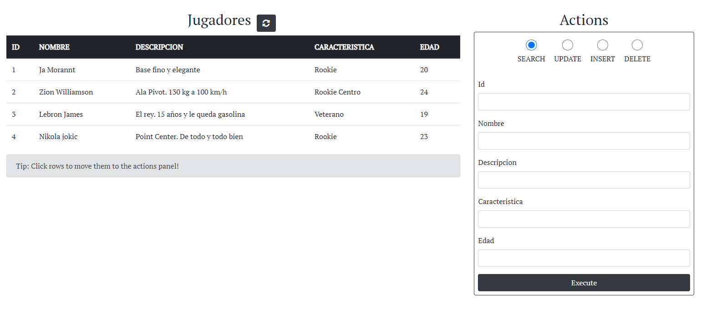
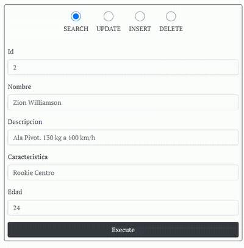

# PHP-MySQL CRUD

#### Technologies:
- HTML, CSS
- Bootstrap
- Javascript
- MySQL
- PHP

#### Features:
- Responsive
- Dinamic form
- AJAX requests
- Rest API in PHP
- CRUD between Javascript, PHP and MySQL

This was a class project where we had to create an API in PHP for CRUD functionality (Create, read, update and delete) from a MySQL table.
Then this API is accesed from javascript using AJAX. The website offers an intuitive way to make this actions thanks to its autocompletition and auto-variable fields. Also the page is responsive!

